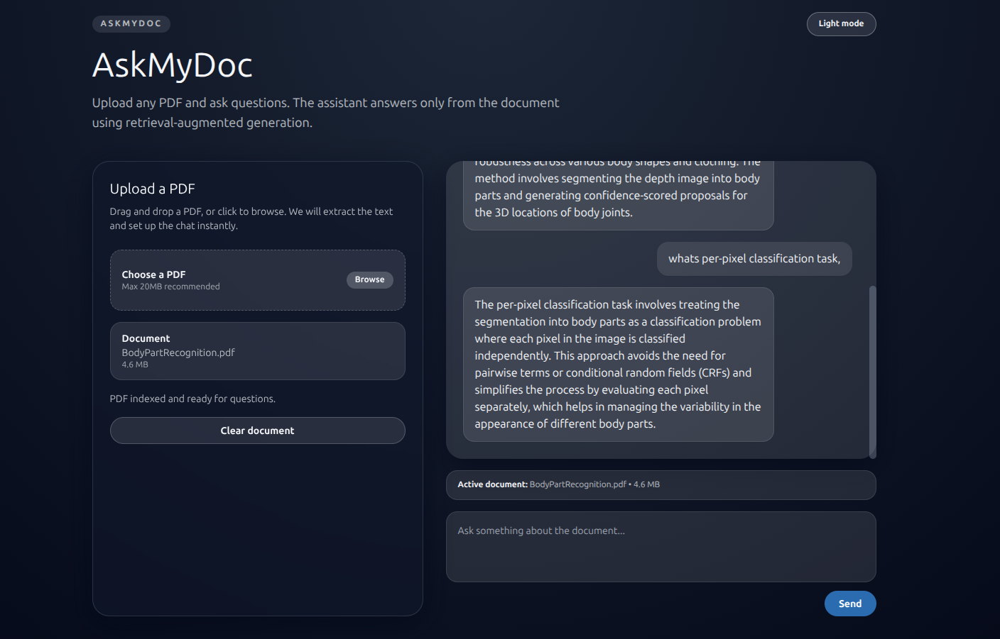

# AskMyDoc
A PDF chat assistant built to learn retrieval-augmented generation end to end.

AskMyDoc lets a user upload a PDF, index its text, and ask questions answered only from the uploaded document. The current codebase is the `V1` release. Future architectural work such as hosted vector search, authentication, and broader multi-user support will be tracked under `V2`.

## Version Status

### V1: Shipped
`V1` is a local-first single-document RAG application.

Included in `V1`:
- PDF upload and text extraction with `pdfplumber`
- Text chunking with `RecursiveCharacterTextSplitter`
- OpenAI embeddings using `text-embedding-3-large`
- Local ChromaDB persistence in `backend/chroma_db/`
- Document-grounded chat responses using `gpt-5.4-nano`
- FastAPI backend with `/upload`, `/chat`, and `/health`
- Next.js frontend with an upload-first flow:
  upload screen -> indexing transition -> chat screen
- Human-readable answer prompting that paraphrases retrieved content instead of echoing raw source fragments

Current `V1` constraints:
- No authentication
- No multi-user document ownership
- No hosted vector database
- No OCR fallback for scanned PDFs
- No citations UI or streaming responses

### V2: Planned
`V2` is the next architectural phase, not yet implemented in this repository.

Planned upgrades for `V2`:
- Pinecone instead of local ChromaDB
- Google authentication
- More production-oriented document and user architecture
- Better persistence and retrieval management across sessions

When `V2` is complete, this README should be updated with:
- final `V2` architecture
- infra and auth decisions
- migration notes from `V1`
- any API or environment variable changes

## Why I Built This
This project was built to understand how a practical RAG system works across the full path: extraction, chunking, embeddings, vector search, prompt construction, and grounded generation. The goal was to build a real working system with production-adjacent tools rather than a tutorial toy app.

## V1 Architecture
`V1` works like this:

1. The frontend uploads a PDF to `POST /upload`.
2. The backend extracts text from the PDF in memory.
3. The text is chunked into overlapping segments.
4. Chunks are embedded with OpenAI.
5. Embeddings are stored in a Chroma collection keyed by a generated `document_id`.
6. The frontend sends a question and `document_id` to `POST /chat`.
7. The backend retrieves the most relevant chunks and generates an answer strictly from that context.

## V1 Stack

Backend:
- FastAPI
- pdfplumber
- LangChain
- langchain-chroma
- ChromaDB
- OpenAI API
- Pydantic

Frontend:
- Next.js 14 App Router
- React 18
- TypeScript

## Project Structure

```text
backend/
  main.py                  FastAPI app and CORS setup
  routers/
    upload.py              PDF upload endpoint
    chat.py                Chat endpoint
  services/
    pdf_extractor.py       PDF text extraction
    text_chunker.py        Chunking logic
    embedder.py            OpenAI embedding model loader
    vector_store.py        Chroma persistence and retrieval
    rag_pipeline.py        Retrieval + answer generation
  models/
    schemas.py             API request/response models

frontend/
  app/
    layout.tsx             App shell
    page.tsx               Upload/index/chat flow
  components/
    PDFUploader.tsx        Upload UI
    ChatWindow.tsx         Conversation display
    ChatInput.tsx          Auto-growing message input
    MessageBubble.tsx      Individual chat message UI
  lib/
    api.ts                 Frontend API client
```

## Local Development

### Backend
```bash
python -m venv .venv
source .venv/bin/activate
pip install -r backend/requirements.txt
cp backend/.env.example backend/.env
uvicorn backend.main:app --reload
```

### Frontend
```bash
cd frontend
npm install
npm run dev
```

Open `http://localhost:3000`.

## Environment Variables

Backend:
```env
OPENAI_API_KEY=your_openai_api_key_here
OPENAI_CHAT_MODEL=gpt-5.4-nano
OPENAI_EMBEDDING_MODEL=text-embedding-3-large
```

Frontend:
```env
NEXT_PUBLIC_API_BASE=http://localhost:8000
```

## API

`POST /upload`
- Accepts a PDF file as multipart form data
- Returns `document_id`, `chunk_count`, and `stored_count`

`POST /chat`
- Body: `{ "document_id": "<uuid>", "question": "..." }`
- Returns a document-grounded answer

`GET /health`
- Health check

## Data Handling
- Uploaded PDFs are processed in memory and are not stored by default
- Embeddings are stored locally in `backend/chroma_db/`
- Answers are generated only from retrieved document context

## Notes for Future Versions
Use this section when `V2` work starts landing:

- replace Chroma-specific notes with Pinecone details
- document auth flow and session model
- document user/document ownership rules
- add deployment notes if the app stops being local-first
- record any breaking changes between `V1` and `V2`
