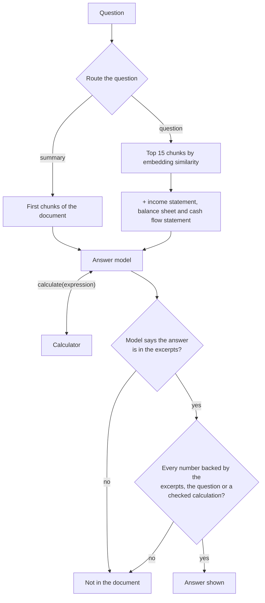

# AskMyDoc

**Ask questions about a company's 10-K and get answers you can check.**

AskMyDoc is a document Q&A app built for financial filings. You upload a filing, ask a question in plain English ("What was Amazon's FY2017 days payable outstanding?"), and get an answer drawn only from that document. When a figure has to be calculated, the app does the arithmetic with a calculator, not the language model, and checks every number in the answer against the filing before showing it. When the filing doesn't contain the answer, it says so instead of guessing.

The project's other half is the measurement: an 85-question benchmark built from [FinanceBench](https://github.com/patronus-ai/financebench) and FinQA, with a hand-verified answer key, fixed scoring rules, and a test set kept aside and run once.

| Working set (51 questions, 12 filings) | Result |
|---|---|
| Answerable questions answered correctly | **29 of 41** (average of five runs, about 29) |
| "Not in the document" questions correctly refused | **10 of 10** in every run |
| **Held-out test set (34 questions, 8 filings, run once)** | |
| Answerable questions answered correctly | **21 of 26** |
| "Not in the document" questions correctly refused | **8 of 8** |

Where these numbers come from, and what they don't show, is explained in [The benchmark](#the-benchmark).

---

## Contents

- [What it does](#what-it-does)
- [How a question gets answered](#how-a-question-gets-answered)
- [The benchmark](#the-benchmark)
- [Testing](#testing)
- [Keeping AI costs under a fixed budget](#keeping-ai-costs-under-a-fixed-budget)
- [Run it locally](#run-it-locally)
- [Architecture](#architecture)
- [Design decisions](#design-decisions)
- [Data handling](#data-handling)
- [What's next](#whats-next)

---

## What it does

**For someone reading a filing**

- Sign in with email and password or Google, upload a PDF (or Markdown) filing, and ask questions about it in a chat workspace modelled on modern assistant apps.
- Each document has its own conversation, saved and restored when you come back.
- Answers come only from the uploaded document. Calculated figures show their working, for example `(177,866 − 135,987) ÷ 135,987 × 100 = 30.8%`.
- If the filing doesn't answer the question, or the app can't back up its answer, you get "I couldn't find enough information in the document to answer that question" rather than a confident guess.

**Behind the scenes**

- Every protected request is authorised on the server: the Next.js frontend signs an internal header with the user's identity, and the FastAPI backend checks it and enforces ownership of every document and conversation.
- Uploads and deletions are explicit, step-by-step lifecycles with typed failure reasons, so a half-finished upload or a partly failed cleanup is reported and can be retried rather than left in a broken state.
- The frontend's request and response types are generated from the backend's OpenAPI schema, so the two sides can't drift apart silently.
- Every AI call is metered against a monthly budget (see [below](#keeping-ai-costs-under-a-fixed-budget)).

---

## How a question gets answered


```mermaid
flowchart TD
    Q[Question] --> R{Route the question}
    R -- summary --> H[First chunks of the document]
    R -- question --> S[Top 15 chunks by embedding similarity]
    S --> F[+ income statement, balance sheet and cash flow statement]
    H --> M[Answer model]
    F --> M
    M <-->|"calculate(expression)"| C[Calculator]
    M --> J{Model says the answer<br/>is in the excerpts?}
    J -- no --> X[Not in the document]
    J -- yes --> G{Every number backed by the<br/>excerpts, the question or a<br/>checked calculation?}
    G -- no --> X
    G -- yes --> A[Answer shown]
```

1. **Indexing.** On upload, the text is extracted (`pdfplumber`, with table-aware handling), split into chunks of about 2,000 characters with 200 characters of overlap, embedded with Voyage `voyage-4-lite`, and stored in a Chroma collection for that document.
2. **Routing.** The answer model decides whether the question asks for a summary or a specific answer. Summaries read the start of the document; questions use semantic search.
3. **Retrieval.** The 15 chunks closest to the question are retrieved. Financial questions often need a line from a statement that a similarity search ranks low, so the filing's three primary statements (income statement, balance sheet, cash flow statement) are always added. They're found by their titles and their density of figures.
4. **Answering.** The answer model (Groq-hosted `gpt-oss`) writes a structured reply: whether the answer is in the excerpts, and the answer itself. It has one tool, `calculate`, and is told to use it for every arithmetic step. The calculator reads plain arithmetic only, by walking Python's syntax tree, so nothing the model sends can run as code.
5. **Checking.** Before the answer is shown, every number in it must be accounted for. It must appear in the excerpts or the question (allowing for units and rounding: "$8.74 billion" matches "8,738" in millions), or come from shown working that is arithmetically correct, or come from a calculator result whose inputs are themselves backed. A number that can't be accounted for turns the answer into the "not in the document" response. Words aren't checked: an earlier word-overlap check rejected honest paraphrases and still let wrong answers through.
6. **Saving.** The question and answer are stored with the conversation, and the API returns the answer with its status, retrieval mode and citations.

---

## The benchmark

### Why build one

A RAG demo can look right on the questions you try by hand and still be wrong a third of the time. To know whether a change helped, I needed a fixed set of real questions with checked answers, scored the same way every time.

### The questions and filings

All of it lives in [`evals/financial-filings/`](evals/financial-filings/).

| | |
|---|---|
| **Filings** | 20 public company reports, 10-Ks plus one 10-Q and two annual reports, from 3M, Activision Blizzard, Adobe, AES, Amazon, AMD, Amcor, American Express, Best Buy, Block, Boeing, CVS Health, Entergy, General Mills, Johnson & Johnson, Microsoft, PepsiCo, Pfizer, Ulta Beauty and Verizon |
| **Questions** | 85: 67 with an answer in the filing, and 18 "traps" asking for something the filing doesn't contain, where the right response is "not in the document" |
| **Question types** | Direct lookups, table lookups, calculations (margins, growth rates, ratios, days payable), multi-step reasoning, and narrative questions (legal proceedings, geographies, customers) |
| **Split** | By filing, so no filing appears in both: **51 working questions** (41 answerable, 10 traps, 12 filings) for building and tuning, and **34 held-out questions** (26 answerable, 8 traps, 8 filings) run once at the end |

**Sources**

- **[FinanceBench](https://github.com/patronus-ai/financebench)** by Patronus AI ([paper](https://arxiv.org/abs/2311.11944)): 59 answerable questions, their evidence passages and 18 of the filings, from the public sample at commit `cc39aeb4`. Licensed [CC BY-NC 4.0](https://creativecommons.org/licenses/by-nc/4.0/). Ten questions were reworded to remove ambiguity, as noted per question.
- **[FinQA](https://github.com/czyssrs/FinQA)** via the pdfQA annotations on Hugging Face: 8 calculation questions over the Entergy 2009 and General Mills 2018 reports.
- **The 18 trap questions** were written for AskMyDoc.

Because it includes FinanceBench material, the eval folder is shared for non-commercial use under CC BY-NC 4.0. The filings are public reports; they're downloaded from their original URLs (pinned by SHA-256 in `manifest.json`), not redistributed.

### Checking the answer key

Public benchmark answers aren't always right, so before trusting any score the key itself was checked:

- **Every calculated answer was recomputed** from the filing's own figures, with the formula recorded in [`verification/answer-recomputes.json`](evals/financial-filings/verification/answer-recomputes.json).
- **Every trap question was confirmed absent** by searching the filing's full text ([`verification/absence-checks.json`](evals/financial-filings/verification/absence-checks.json)).
- **Every answer's evidence was mapped to the stored chunks that contain it** ("gold chunks"), so a run can report whether the right passage reached the model at all, separately from whether the model then answered correctly.
- **Nine answers were revised** before any run: seven corrections, and two inventory-turnover questions that accept either standard formula. Four more were corrected later, when a failed answer exposed a key that was wrong or ambiguous. Each of those is provable from the filing alone and documented in the scoring rules. Every revision keeps the original answer, and every report also shows the score under the original key.

### Scoring

The rules in [`scoring-rules.md`](evals/financial-filings/scoring-rules.md) were written before the first run and only change for a reason provable without looking at results.

- **Numbers** pass when they round to the expected value. The tolerance is half the last decimal shown in the key, so `93.86` accepts 93.855–93.865. Units, commas and currency signs are normalised first, and "(0.6)%" reads as negative.
- **Yes/no answers** need the right verdict, implied or stated, plus correct support. Hedging fails.
- **Prose answers** are checked against a strict checklist: every key fact present, nothing contradicting the key, and the right company and period. Partial answers fail. In the runs reported here the checklist was filled in by hand against the key; the evaluator can also ask a grader model to fill it in.
- **Trap questions** pass only on the app's "not in the document" response.
- The score is for the answer the user would see. A correct draft that the app blocked counts as a failure.

### Results

Each row is a change to the app and the score it measured on the 41 answerable working questions. Trap questions were refused correctly, 10 of 10, in every run.

| Change | Answerable correct |
|---|---|
| Starting point: plain Voyage search, answers checked by word overlap | 5 / 41 |
| Check answers by their numbers instead of their words | 15 / 41 |
| Drop the model-based evidence picker; send the top 15 chunks instead | 19 / 41 |
| Give the answer model a calculator | about 23 / 41 (three runs) |
| Always include the three primary statements; let "there are none" be an answer | about 29 / 41 (three runs) |
| Final merged code, after code review fixes | 29 / 41 (five-run average about 29) |

The **held-out set** was run once, on the final pipeline before code review: **21 of 26** answerable and **8 of 8** traps. One of the five misses was a correct answer blocked by a bug in the number check, which read the "(000)" in-thousands marker as a figure. That bug was fixed afterwards. The held-out set was not run again, so the 21 stands.

A run of all 51 working questions costs about $0.12 in model calls.

### What the numbers don't show

- **Single runs vary.** The model isn't deterministic, and one question flipping between runs moves the score by 2–3 points. Comparisons above use several runs where it mattered.
- **The prose checklist is filled in by hand.** It's strict and written down, but it's one reviewer's judgement.
- **The remaining misses** are mostly the model misreading what a finance question wants: countries listed instead of regions, a tax rate's sign, a revenue split by product instead of by segment. There are also a few cases where the model says the answer isn't there when it is, and a few correct answers that state a final difference without showing the working the check needs.
- **Retrieval isn't the bottleneck any more.** The right passages reach the model for 39 of the 41 answerable questions.

### Reproducing the benchmark

```bash
# 1. Download each PDF in evals/financial-filings/manifest.json to its `path`, and check its SHA-256.

# 2. Index the filings into the local Chroma store, the same way an upload does
.venv/bin/python -m backend.scripts.index_eval_documents \
    --corpus evals/financial-filings/manifest.json \
    --output evals/financial-filings/indexed-documents.local.json

# 3. Map each answer's evidence to chunk IDs
.venv/bin/python -m backend.scripts.build_eval_cases \
    --proposed evals/financial-filings/cases.json \
    --indexed evals/financial-filings/indexed-documents.local.json \
    --output evals/financial-filings/cases.local.json \
    --recomputes evals/financial-filings/verification/answer-recomputes.json

# 4. Ask every working question through the real pipeline and score the answers
.venv/bin/python -m backend.scripts.evaluate_answers \
    --cases evals/financial-filings/cases.local.json --split working --limits 15 --output results.json

# Re-score a saved report after a provable scoring-rule fix, without asking again
.venv/bin/python -m backend.scripts.evaluate_answers \
    --cases evals/financial-filings/cases.local.json --rescore results.json
```

Also available:

- `evaluate_retrieval` measures whether the gold chunks are retrieved at all. Its experimental switches (`--hybrid` keyword search, `--planner`, and the reranker) can be compared there.
- `reindex_documents` re-embeds stored documents in place after an embedding model change. It writes to a staging collection first, so a failed run never leaves a document unsearchable.

---

## Testing

| Layer | What it covers | How to run |
|---|---|---|
| **Backend unit and integration tests** (224) | Ownership and auth, upload and delete lifecycles, the answer pipeline and its fallbacks, the number check, the calculator, statement detection, the scorer, gold-chunk mapping, the usage ledger and budget, re-indexing against a real temporary Chroma store, and the API contract staying in sync | `.venv/bin/python -m unittest discover -s backend/tests -p 'test_*.py'` |
| **Frontend tests** | The workspace state machine (upload, select, send, delete, recovery, stale async updates), upload validation and the backend proxy | `cd frontend && npm test` |
| **Lint and type checks** | Next.js lint and TypeScript | `cd frontend && npm run lint && npx tsc --noEmit` |
| **Benchmark** | End-to-end answer quality on real filings | See [The benchmark](#the-benchmark) |

CI runs the backend tests, frontend tests, lint and type checks on every pull request, and `main` only accepts branches that are up to date and green.

Changes to the answer check are also tested against real model output without paying for new answers. The saved answers from earlier runs (306 so far) are replayed through the new check, which shows whether any real answer would flip between passing and failing.

---

## Keeping AI costs under a fixed budget

The whole project runs on a budget of $5 a month, testing included, so spending is a feature, not an afterthought.

- **Cheap, capable providers.** Chat runs on [Groq](https://groq.com/)-hosted open-weight `gpt-oss` models, and embeddings on [Voyage AI](https://www.voyageai.com/) `voyage-4-lite`. The model is chosen per job in the environment: `AI_ANSWER_MODEL` for routing, summaries and answers, `AI_CHAT_MODEL` for suggested questions, `AI_GRADER_MODEL` for the eval grader, and `AI_EMBEDDING_MODEL`. The benchmark used `openai/gpt-oss-120b` for answers; the default is the smaller `gpt-oss-20b`.
- **Every call is metered.** All AI calls go through one module (`backend/services/ai_providers.py`), which records the tokens the provider reported in a local ledger (`backend/usage/ledger.jsonl`) and prices them from a table of list prices.
- **A hard monthly stop.** Before each paid call, this month's billed spend is checked against `AI_MONTHLY_BUDGET_USD` (default $5). Once it's reached, paid calls are refused with a clear message. Calls covered by Voyage's free token allowance keep working.
- **A local dashboard.** `backend/usage/dashboard.html` shows spend against the budget, by model and by job, and how much of the free allowance is used.

---

## Run it locally

You need Python 3.11, Node.js 20, a Supabase project, and API keys for Groq and Voyage AI.

```bash
python3 -m venv .venv
.venv/bin/pip install -r backend/requirements.txt
cd frontend && npm ci && cd ..
cp -n backend/.env.example backend/.env
cp -n frontend/.env.example frontend/.env
```

Fill in both `.env` files:

- **Backend:** `GROQ_API_KEY`, `VOYAGE_API_KEY`, the Supabase URL, service-role key and storage bucket, and `INTERNAL_API_SECRET`.
- **Frontend:** the NextAuth and Google sign-in settings and the same Supabase values. Set the frontend's `NEXTAUTH_SECRET` to the same value as the backend's `INTERNAL_API_SECRET`, or protected requests will fail.

The SQL for the Supabase users table is in [`docs/supabase-users.sql`](docs/supabase-users.sql).

Then start both servers:

```bash
./dev.sh
```

The backend runs at `http://localhost:8000` and the frontend at `http://localhost:3000`. Ctrl+C stops both.

---

## Architecture

**Backend** (`backend/`)

- **FastAPI** for the HTTP API, with signed internal auth headers and server-side ownership checks.
- **pdfplumber** for text and table extraction; Markdown is read directly.
- **LangChain** text splitting and model wrappers.
- **ChromaDB**, one local collection per document.
- **Groq** (`gpt-oss`) for chat and **Voyage AI** (`voyage-4-lite`) for embeddings, both behind the metered `ai_providers` module.
- **Supabase** for users, document metadata, conversations, messages and stored files.

Key modules:

| Module | Role |
|---|---|
| `services/rag_pipeline.py` | The answer policy: routing, retrieval, the calculator loop, the structured reply and the fallbacks |
| `services/rag_adapters.py` | Chroma retrieval, including the three-statements addition |
| `services/financial_statements.py` | Finds the primary statements in a filing |
| `services/calculator.py` | The calculator tool and its safe evaluator |
| `services/answer_grounding.py` | The number check |
| `services/usage_ledger.py`, `usage_dashboard.py` | Spend tracking, the budget stop and the dashboard |
| `scripts/` | Benchmark indexing, case building, evaluation, scoring and re-indexing |

**Frontend** (`frontend/`)

- **Next.js 14** App Router with TypeScript and Tailwind.
- **NextAuth.js** for email/password and Google sign-in.
- Route handlers that proxy browser requests to the backend with signed identity.
- `lib/api-contract.ts`, generated from the backend's OpenAPI schema.
- A workspace state module that drives upload, selection, chat, search and delete through one controller, and ignores stale async results when you switch documents quickly.

---

## Design decisions

**Why check numbers, not words?** In a filings app the failure that matters is an invented or miscalculated figure. Checking that the answer's words overlap the excerpts blocked honest paraphrases ("Yes, it retained its card members") and passed wrong answers built from the document's own vocabulary. Checking every number, and the arithmetic behind it, tripled the share of correct answers. The cost: a wrong claim with no number in it isn't caught by this check.

**Why a calculator instead of a better model?** Moving from `gpt-oss-20b` to `gpt-oss-120b` didn't change the score. The losses were arithmetic slips, such as 93.91 days instead of 93.86, or subtracting already-rounded margins. Giving the model a calculator and requiring it for every step fixed most of them for the cost of a few extra calls.

**Why the top 15 chunks and the three statements, rather than a smart picker?** A model choosing the "needed" chunks from a larger shortlist looked good in retrieval tests but often dropped the exact table the answer needed. Sending the top 15 by similarity, plus the statements that nearly every financial question draws on, got the right evidence to the model far more often, and cost less.

**Why separate working and held-out sets?** Every fix here was found by looking at failures on the working set, which risks tuning to those 51 questions. The 34 held-out questions, on filings never looked at during development, were run once to check that the gains carry over.

**Why server-derived identity?** The backend authorises on identity asserted by the app's own server, never on a user ID sent from the browser.

**Why a generated API contract?** Upload and delete lifecycles and structured chat answers have enough states that hand-maintained types on both sides would drift. Generating them from the backend schema keeps them in sync.

---

## Data handling

- Uploaded files are processed in memory, then stored in Supabase Storage.
- Embeddings live in a Chroma collection per document; conversations and messages live in Supabase, scoped to their owner.
- Deleting a document removes its metadata, the stored file, its conversations and messages, and its vector index. A partial failure is reported and can be retried.
- The usage ledger records token counts and costs only, never prompts or answers.
- Benchmark filings and local index IDs are kept out of the repository; only the questions, answer key, scoring rules and verification records are committed.

---

## What's next

- **A finance-aware agent** for the misses that remain: questions where the model misreads what's being asked (segments vs products, regions vs countries, signs on loss-year tax rates).
- **Citations in the chat UI.** They're already returned by the API.
- **OCR** for scanned filings, and questions that span more than one filing.
- **Streaming answers.**
